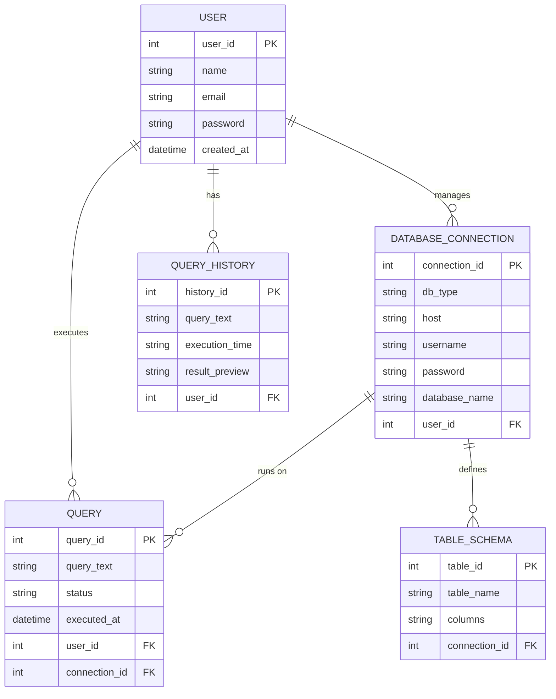

# 🎨 Design & Code Quality  

## 🧱 ER Diagram  

A well-structured and clearly labeled **Entity-Relationship Diagram (ERD)** shows how different entities in the **SQL Query Runner** system interact with each other.  
This diagram represents the logical structure of the underlying database — designed using **Prisma ORM** and compatible with **SQLite / MySQL / PostgreSQL**.

---

### 🗂️ Database Entities Overview  

| Entity | Description |
|--------|--------------|
| **User** | Stores information about registered users who can execute queries and save history. |
| **Query** | Represents each SQL command executed by a user, along with timestamp and result status. |
| **DatabaseConnection** | Contains credentials/configuration details for connecting to MySQL/PostgreSQL/SQLite databases. |
| **TableSchema** | Stores metadata about tables created or imported by users (columns, types, constraints). |
| **QueryHistory** | Keeps records of previously executed queries for re-run and reference. |

---

### 🧩 ER Diagram (Mermaid Code)  

### 🧠 Design Notes

The User entity acts as the central node for authentication and personalization.
Each user can have multiple database connections (MySQL, PostgreSQL, SQLite).
Queries are linked both to a user and the database they were executed on.
TableSchema helps the frontend’s auto-completion feature suggest table and column names.
QueryHistory provides re-run and revision tracking for executed SQL commands.

### 💎 Code Quality Practices

**Clean Architecture**: Separated frontend/ and backend/ layers with independent responsibilities.
**Naming Consistency**: Followed camelCase for variables and PascalCase for components.
**Error Handling**: Implemented structured try–catch blocks with user-friendly error feedback.
**Validation**: Input and query validation done before execution to prevent SQL injection.
**Readability**: Proper code comments, indentation, and ESLint setup for standard formatting.
**Modularity**: Reusable components in React and modularized controllers in Node.js.
**Version Control**: Managed collaboration via GitHub branches and meaningful commits.
